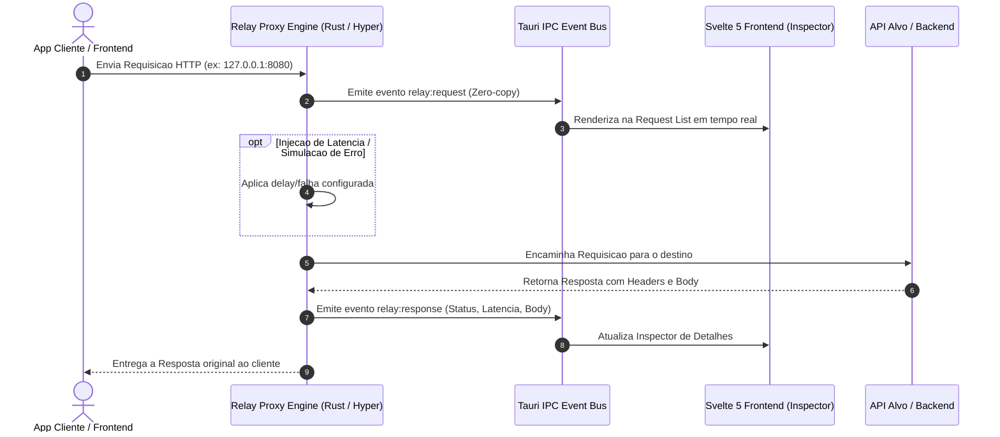

# Relay

<div align="center">


-4E9A06?style=for-the-badge&logo=linux&logoColor=white)

**Utilitario desktop nativo, ultraleve e de alta performance para desenvolvedores.**  
Proxy Reverso Local, Interceptador de Trafego HTTP, Inspecionador em Tempo Real e Replay de Requisicoes.

</div>

---

## Por que o Relay?

O Relay foi projetado para substituir clientes pesados de API por um proxy leve e integrado ao seu fluxo diario de desenvolvimento.

Construido com arquitetura nativa em **Rust (Tokio + Hyper)** e **Tauri v2 com Svelte 5**:
* **Streaming Assincrono:** Repasse de trafego quase instantaneo com fatias de bytes em memoria.
* **Auto-Descoberta de Portas:** Escaneamento nao-bloqueante de portas e servicos locais de desenvolvimento.
* **Gerenciamento de Ambientes:** Alternancia rapida entre servicos locais, rotas de mock e endpoints de homologacao.
* **Captura Inteligente de Sessao:** Deteccao automatica e decodificacao de tokens JWT no trafego.
* **Interface Fluida:** Reatividade nativa sem Virtual DOM utilizando Svelte 5 Runes.

---

## Fluxo de Interceptacao



---

## Guia de Inicio Rapido (Linux)

### 1. Pre-requisitos
Certifique-se de possuir o compilador **Rust** e o **Node.js**:

```bash
# Instalar Rust (via Rustup)
curl --proto '=https' --tlsv1.2 -sSf https://sh.rustup.rs | sh -s -- -y
source "$HOME/.cargo/env"
```

### 2. Dependencias do Sistema

<details>
<summary><b>Fedora / RHEL / AlmaLinux</b> (Clique para expandir)</summary>

```bash
sudo dnf install -y \
  gcc gcc-c++ webkit2gtk4.1-devel openssl-devel \
  curl wget file libappindicator-gtk3-devel librsvg2-devel
```
</details>

<details>
<summary><b>Ubuntu / Debian / Mint</b> (Clique para expandir)</summary>

```bash
sudo apt update && sudo apt install -y \
  build-essential curl wget file libssl-dev libgtk-3-dev \
  libayatana-appindicator3-dev librsvg2-dev libwebkit2gtk-4.1-dev
```
</details>

<details>
<summary><b>Arch Linux / Manjaro</b> (Clique para expandir)</summary>

```bash
sudo pacman -Syu --needed \
  base-devel curl wget openssl gtk3 libappindicator-gtk3 librsvg webkit2gtk-4.1
```
</details>

---

### 3. Rodando o Projeto

```bash
# 1. Instale as dependencias do frontend
npm install

# 2. Inicie em modo de desenvolvimento (com Hot-Reload no Rust e Svelte)
npm run tauri dev
```

---

## Documentacao dos Modulos

| Modulo | Descricao |
| :--- | :--- |
| **Proxy Engine** | Motor TCP assincrono Tokio + Hyper, rotas de Mock e Chaos Simulator |
| **Live Inspector** | Visualizacao em tempo real de requisicoes, headers, payloads e cURL generator |
| **JWT & Session** | Deteccao automatica e decodificacao de claims JWT |
| **HTTP Replay** | Reenvio instantaneo e encadeamento automatico de variaveis de resposta |
| **Target Discovery** | Varredura assincrona de portas de desenvolvimento no Linux |

---

## Estrutura do Repositorio

```text
relay/
├── docs/                   # Documentacao arquitetural e de features
├── src/                    # Frontend (Svelte 5 + TypeScript + Tailwind)
│   ├── lib/
│   │   ├── components/     # Componentes modulares
│   │   ├── stores/         # Estados reativos com Svelte 5 Runes ($state)
│   │   └── types/          # Contratos TypeScript sincronizados com Rust
│   ├── App.svelte          # Shell principal da interface desktop
│   └── main.ts             # Entrada da aplicacao Svelte
├── src-tauri/              # Backend Nativo (Rust + Tokio + Hyper)
│   ├── src/
│   │   ├── proxy/          # Motor proxy, scanner de portas e interceptacao
│   │   ├── state/          # Gerenciamento de memoria e session JWT
│   │   ├── commands/       # Tauri IPC commands
│   │   ├── lib.rs          # Handlers e setup do Tauri v2
│   │   └── main.rs         # Entrypoint nativo
│   ├── Cargo.toml          # Dependencias Rust
│   └── tauri.conf.json     # Configuracoes Tauri v2
└── README.md
```

---

## Licenca

Distribuido sob a licenca MIT.
