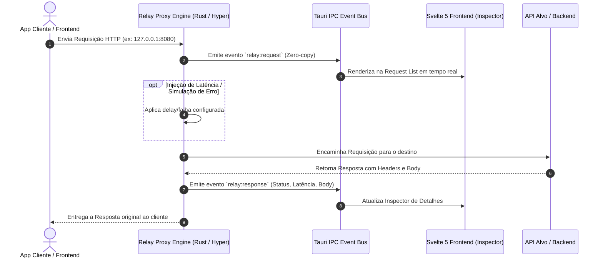

# ⚡ Relay

<div align="center">


-4E9A06?style=for-the-badge&logo=linux&logoColor=white)

**Utilitário desktop nativo, ultraleve e de alta performance para desenvolvedores.**  
Proxy Reverso Local, Interceptador de Tráfego HTTP, Inspecionador em Tempo Real e Replay de Requisições.

</div>

---

## 🎯 Por que o Relay?

Ferramentas tradicionais de depuração de rede baseadas em Electron costumam consumir mais de 500MB de RAM e adicionam latência perceptível ao desenvolvimento diário.

O **Relay** foi construído em **Rust (Tokio + Hyper)** e **Tauri v2 com Svelte 5**:
* **Consumo Mínimo:** Footprint de apenas ~25MB a 35MB de memória RAM.
* **Streaming Zero-Copy:** Repasse de tráfego quase instantâneo com fatias de bytes em memória.
* **Interface Fluida:** Reatividade nativa sem Virtual DOM com Svelte 5 Runes.

---

## 🔄 Fluxo de Interceptação



---

## 🚀 Guia de Início Rápido (Qualquer Linux)

### 1. Instalar Pré-requisitos Básicos
Certifique-se de possuir o compilador **Rust** e o **Node.js**:

```bash
# Instalar Rust (via Rustup)
curl --proto '=https' --tlsv1.2 -sSf https://sh.rustup.rs | sh -s -- -y
source "$HOME/.cargo/env"
```

### 2. Instalar Dependências do Sistema

Selecione a sua distribuição Linux:

<details>
<summary><b>🔴 Fedora / RHEL / AlmaLinux</b> (Clique para expandir)</summary>

```bash
sudo dnf install -y \
  gcc gcc-c++ webkit2gtk4.1-devel openssl-devel \
  curl wget file libappindicator-gtk3-devel librsvg2-devel
```
</details>

<details>
<summary><b>🟠 Ubuntu / Debian / Pop!_OS / Mint</b> (Clique para expandir)</summary>

```bash
sudo apt update && sudo apt install -y \
  build-essential curl wget file libssl-dev libgtk-3-dev \
  libayatana-appindicator3-dev librsvg2-dev libwebkit2gtk-4.1-dev
```
</details>

<details>
<summary><b>🔵 Arch Linux / Manjaro / EndeavourOS</b> (Clique para expandir)</summary>

```bash
sudo pacman -Syu --needed \
  base-devel curl wget openssl gtk3 libappindicator-gtk3 librsvg webkit2gtk-4.1
```
</details>

<details>
<summary><b>🟢 openSUSE (Tumbleweed / Leap)</b> (Clique para expandir)</summary>

```bash
sudo zypper install -y \
  gcc gcc-c++ gtk3-devel webkit2gtk4.1-devel \
  libappindicator3-devel librsvg-devel openssl-devel
```
</details>

> 📖 Para instruções detalhadas e outras distribuições, consulte o [Guia de Instalação Linux](docs/installation/linux.md).

---

### 3. Rodando o Projeto

```bash
# 1. Instale as dependências do frontend
npm install

# 2. Inicie em modo de desenvolvimento (com Hot-Reload no Rust e Svelte)
npm run tauri dev
```

---

## 📚 Documentação das Funcionalidades

O Relay é estruturado em módulos independentes e bem documentados:

| Módulo | Descrição | Documento |
| :--- | :--- | :--- |
| **Proxy Engine** | Motor TCP assíncrono Tokio + Hyper e injeção de latência/falhas | [Ver detalhes](docs/features/01-proxy-engine.md) |
| **Live Inspector** | Visualização em tempo real de requisições, headers e payloads | [Ver detalhes](docs/features/02-traffic-inspector.md) |
| **JWT & Session** | Detecção automática e decodificação de tokens JWT | [Ver detalhes](docs/features/03-jwt-session.md) |
| **HTTP Replay** | Reenvio instantâneo e edição de chamadas gravadas | [Ver detalhes](docs/features/04-http-replay.md) |
| **Decisões de Arquitetura** | Registro formal da escolha da stack tecnológica | [ADR 0001](docs/adr/0001-escolha-da-stack-tauri-rust.md) |
| **Roadmap** | Cronograma de evolução e próximas entregas | [Roadmap](docs/roadmap.md) |

---

## 📂 Estrutura do Repositório

```text
relay/
├── docs/                   # Documentação arquitetural e de features
│   ├── adr/                # Architectural Decision Records
│   ├── features/           # Documentação técnica por funcionalidade
│   ├── installation/       # Guias de setup por sistema operacional
│   ├── architecture.md     # Visão geral de camadas
│   └── roadmap.md          # Fases de entrega
├── src/                    # Frontend (Svelte 5 + TypeScript + Tailwind)
│   ├── lib/
│   │   ├── components/     # Componentes de UI modulares
│   │   ├── stores/         # Estados reativos com Svelte 5 Runes ($state)
│   │   └── types/          # Contratos TypeScript sincronizados com Rust
│   ├── App.svelte          # Shell principal da interface desktop
│   └── main.ts             # Ponto de entrada do app Svelte
├── src-tauri/              # Backend Nativo (Rust + Tokio + Hyper)
│   ├── src/
│   │   ├── proxy/          # Motor de proxy reverso e interceptação
│   │   ├── state/          # Gerenciamento de memória e JWT store
│   │   ├── commands/       # Tauri IPC commands invocáveis pela UI
│   │   ├── lib.rs          # Inicialização e registro de handlers Tauri
│   │   └── main.rs         # Entrypoint nativo
│   ├── Cargo.toml          # Dependências Rust
│   └── tauri.conf.json     # Configuração da janela e sandbox Tauri v2
└── README.md
```

---

## 📄 Licença

Distribuído sob a licença MIT.
