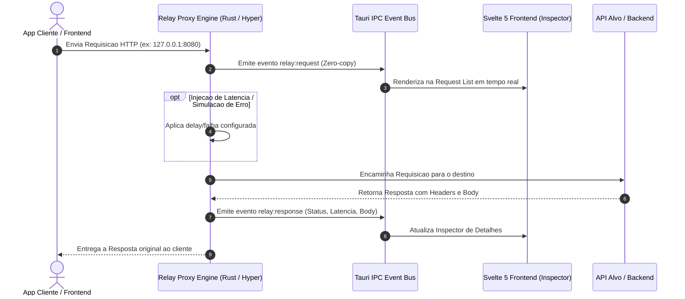

# Relay

<div align="center">


-4E9A06?style=for-the-badge&logo=linux&logoColor=white)

**Utilitario desktop nativo, ultraleve e de alta performance para desenvolvedores.**  
Proxy Reverso Local, Interceptador de Trafego HTTP, Inspecionador em Tempo Real e Replay de Requisicoes.

</div>

---

## Por que o Relay?

O Relay foi projetado para substituir clientes pesados de API por um proxy leve e integrado ao seu fluxo diario de desenvolvimento.

Construido com arquitetura nativa em **Rust (Tokio + Hyper)** e **Tauri v2 com Svelte 5**:
* **Streaming Assincrono:** Repasse de trafego quase instantaneo com fatias de bytes em memoria.
* **Sistema de Multi-Projetos:** Workspaces isolados com persistencia automatica para gerenciar rotas, mocks e colecoes sem misturar APIs.
* **Importador Universal:** Suporte nativo a importacao direta de arquivos OpenAPI 3.0 / Swagger e colecoes Postman v2.1 em pastas dinamicas.
* **Auto-Descoberta de Portas:** Escaneamento nao-bloqueante e neutro de portas e servicos locais de desenvolvimento.
* **Gerenciamento de Ambientes:** Alternancia rapida entre servicos locais, rotas de mock e endpoints de homologacao.
* **Captura Inteligente de Sessao:** Deteccao automatica e decodificacao de tokens JWT no trafego.
* **Interface Fluida:** Reatividade nativa sem Virtual DOM utilizando Svelte 5 Runes.

---

## Pré-requisitos (Linux)

Antes de compilar ou rodar o projeto, você precisa ter as dependências do **Node.js** e do **Rust/Tauri** instaladas no sistema.

**1. Dependências do Sistema (Ubuntu / Debian / Mint):**
```bash
sudo apt update
sudo apt install libwebkit2gtk-4.1-dev build-essential curl wget file libxdo-dev libssl-dev libayatana-appindicator3-dev librsvg2-dev
```

**2. Compilador Rust:**
```bash
curl --proto '=https' --tlsv1.2 -sSf https://sh.rustup.rs | sh
```

**3. Dependências do Node (Obrigatório antes do build):**
```bash
npm install
```

---

## Compilação & Instalação

Você pode compilar e instalar o Relay diretamente no seu sistema operacional Linux:

### Opção 1: Instalar no Ubuntu / Debian / Mint (.deb)

```bash
# Compila e gera o pacote Debian (Requer 'npm install' feito previamente)
npm run tauri build -- --bundles deb

# Instala no sistema
sudo dpkg -i src-tauri/target/release/bundle/deb/relay_0.1.0_amd64.deb
```

### Opção 2: Instalar no Fedora / RHEL / AlmaLinux (.rpm)

```bash
# Dependências do sistema (Fedora):
# sudo dnf install webkit2gtk4.1-devel curl wget file libappindicator-gtk3-devel librsvg2-devel gcc-c++

# Compila e gera o pacote nativo RPM
npm run tauri build -- --bundles rpm

# Instala no sistema
sudo dnf install -y src-tauri/target/release/bundle/rpm/relay-0.1.0-1.x86_64.rpm
```

### Opção 3: Executável Binário Direto (Portátil)

```bash
# Compila o binário otimizado
npm run tauri build

# Copia para os binários locais do usuário
mkdir -p ~/.local/bin
cp src-tauri/target/release/relay ~/.local/bin/
```

Apos a instalacao, o **Relay** ficara disponivel no menu de aplicativos do seu ambiente desktop (GNOME, KDE Plasma, XFCE) com seu icone oficial e podera ser iniciado digitando `relay` no terminal.

---

## Desenvolvimento Local

Para rodar o projeto com hot-reload ativo:

```bash
# 1. Instale as dependencias do frontend
npm install

# 2. Inicie em modo de desenvolvimento
npm run tauri dev
```

---

## Fluxo de Interceptacao



---

## Documentacao dos Modulos

| Modulo | Descricao |
| :--- | :--- |
| **Proxy Engine** | Motor TCP assincrono Tokio + Hyper, rotas de Mock e Chaos Simulator |
| **Live Inspector** | Visualizacao em tempo real de requisicoes, headers, payloads e cURL generator |
| **JWT & Session** | Deteccao automatica e decodificacao de claims JWT |
| **HTTP Replay** | Disparo de requisicoes manuais com variaveis dinamicas (`{{token}}`, `{{id}}`) |
| **Chaos Engineering** | Injeção de latencia artificial com jitter e simulacao de falhas HTTP |
| **Export & CA** | Exportacao para HAR 1.2, OpenAPI 3.0 e geracao de certificados CA locais |
| **Multi-Projetos & Colecoes** | Workspaces isolados, importador OpenAPI/Postman e pastas em arvore |
| **Ambientes & Scanner** | Deteccao assincrona de portas ativas no Linux e alvos personalizados |
