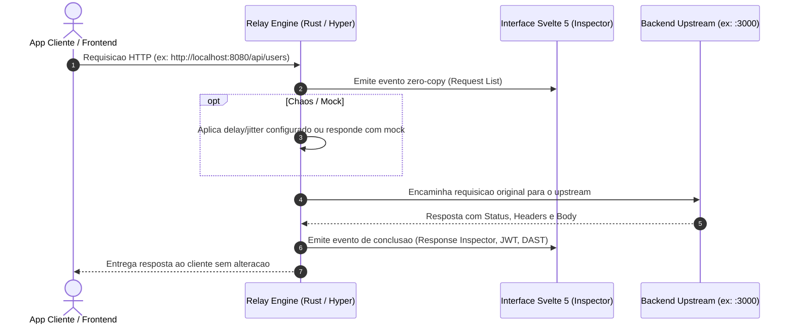

# Relay

<div align="center">


**Utilitario desktop nativo, ultraleve e de alta performance para desenvolvedores.**  
Proxy reverso local, interceptador de trafego HTTP, inspecionador em tempo real, importador de colecoes e replay de requisicoes.

</div>

---

## Recursos Principais

- **Proxy Assincrono Zero-Copy:** Repasse de trafego em fatias de memoria via Rust (Tokio + Hyper) com suporte a tunelamento WebSocket (HTTP 101).
- **Inspecionador em Tempo Real:** Visualizacao instantanea de headers, query params, cookies e payloads com abertura direta na aba Response e gerador de comandos cURL.
- **Importador Universal de Colecoes:** Importacao e organizacao automatica de colecoes OpenAPI 3.0 / Swagger, Postman Collection v2.1 e templates nativos do Relay.
- **Filtros Anti-Ruido e Modo Silencioso:** Deteccao e amortecimento de tráfego de infraestrutura e reconexoes repetitivas sem poluir o historico util.
- **Deteccao Inteligente de Sessao:** Decodificacao automatica de tokens JWT presentes em cabecalhos de autorizacao, cookies ou respostas da API.
- **Replay & Chaos Engineering:** Disparo de chamadas manuais com variaveis dinamicas (`{{token}}`), simulacao de falhas de rede e latencia artificial com jitter.
- **Seguranca Shift-Left & STRIDE:** Auditoria passiva DAST, testes ativos contra vulnerabilidades comuns (BOLA/IDOR, Mass Assignment, Auth Bypass) e modelagem de ameacas STRIDE.

---

## Requisitos de Sistema

- **Linux:** Ubuntu/Debian/Mint, Fedora/RHEL ou Arch Linux.
- **Node.js:** Versao 20 LTS ou superior.
- **Rust & Cargo:** Versao 1.75 ou superior.

### Dependencias Nativas do Linux

**Ubuntu / Debian / Mint:**
```bash
sudo apt update
sudo apt install -y libwebkit2gtk-4.1-dev build-essential curl wget file libxdo-dev libssl-dev libayatana-appindicator3-dev librsvg2-dev
```

**Fedora / RHEL:**
```bash
sudo dnf install -y webkit2gtk4.1-devel curl wget file libappindicator-gtk3-devel librsvg2-devel gcc-c++
```

**Rust:**
```bash
curl --proto '=https' --tlsv1.2 -sSf https://sh.rustup.rs | sh
```

---

## Instalacao Rapida e Determinada

Para evitar divergencias de versoes entre desenvolvedores, o repositorio possui dependencias travadas por versao exata (`save-exact`), configuracao `.npmrc` e um script de inicializacao automatizado:

```bash
# Clone o repositorio
git clone https://github.com/TacioMoreira25/Relay.git
cd Relay
```

O script `./setup.sh` detecta automaticamente o estado da sua maquina:

```bash
./setup.sh
```

- **Se voce ja tem o Relay instalado no Linux (Fedora ou Debian/Ubuntu):**  
  O script detecta a instalacao existente no sistema, compila a nova versao de producao e executa automaticamente a atualizacao (`sudo dnf reinstall -y` no Fedora ou `sudo dpkg -i` no Ubuntu/Debian). Seus dados, workspaces e colecoes permanecem intactos.
- **Se voce ainda nao tem o Relay instalado no sistema:**  
  O script prepara o ambiente de desenvolvimento instalando as dependencias com fidelidade estrita ao lockfile (`npm ci`) e validando o compilador Rust. Para rodar em modo de desenvolvimento com hot-reload, basta executar:
  ```bash
  npm run tauri dev
  ```
- **Parametros Opcionais:**
  - `./setup.sh --install` : Forca a compilacao e instalacao do aplicativo desktop no sistema operacional.
  - `./setup.sh --dev-only`: Prepara apenas as dependencias locais sem compilar o pacote desktop, mesmo que o app ja esteja instalado no sistema.

---

## Guia Didatico de Uso

Usar o Relay no seu fluxo diario exige apenas 3 etapas:

### 1. Iniciar o Relay
Abra o Relay e configure as portas desejadas na barra superior:
- **Porta do Proxy (Listen):** Porta onde o Relay vai escutar (exemplo: `8080`).
- **Alvo Padrao (Upstream Target):** Endereco do seu backend em execucao (exemplo: `http://localhost:3000`).
- Clique em **Iniciar Proxy**.

### 2. Apontar o seu Frontend / Cliente
No seu projeto cliente (Angular, React, Vue, app mobile ou script), aponte a URL base da API para o Relay:

- **Exemplo com variaveis de ambiente:**
  ```typescript
  // Em desenvolvimento, as requisicoes passam pelo Relay:
  export const environment = {
    apiUrl: 'http://localhost:8080' // Porta configurada no Relay
  };
  ```

- **Exemplo em proxy reverso de desenvolvimento (`proxy.conf.json` / `vite.config.ts`):**
  ```json
  {
    "/api": {
      "target": "http://localhost:8080",
      "secure": false,
      "changeOrigin": true
    }
  }
  ```

> **Dica sobre WebSockets e Polling:**  
> Servicos com conexoes persistentes (como Socket.io) devem preferencialmente se conectar direto a porta nativa do backend (`http://localhost:3000`) para evitar poluir o painel de inspecao REST, a menos que o objetivo seja inspecionar o handshake HTTP inicial.

### 3. Inspecionar, Testar e Reproduzir
- O Relay registra cada chamada com status, metodo, latencia e tamanho.
- Clique em qualquer requisicao para abrir os detalhes, visualizar o JSON formatado, extrair tokens JWT ou copiar o comando cURL pronto.
- Use o botao **Replay** para reenviar a chamada alterando parametros ou testar rotas no menu de **Colecoes**.

---

## Comandos Uteis do Projeto

| Comando | Descricao |
| :--- | :--- |
| `./setup.sh` | Valida dependencias locais e atualiza o app no sistema se ja estiver instalado |
| `./setup.sh --dev-only` | Prepara apenas o ambiente local de desenvolvimento sem compilar o desktop |
| `./setup.sh --install` | Forca a compilacao e instalacao/reinstalacao do app no sistema operacional |
| `npm run tauri dev` | Inicia o Relay em modo de desenvolvimento com hot-reload |
| `npm run check` | Executa a verificacao estatica de tipos (TypeScript + Svelte) |
| `cargo test --manifest-path src-tauri/Cargo.toml` | Executa a suite de testes unitarios do backend Rust |
| `npm run tauri build` | Gera o executavel binario otimizado em `src-tauri/target/release/` |
| `npm run tauri build -- --bundles deb` | Gera o pacote de instalacao Debian/Ubuntu (`.deb`) |
| `npm run tauri build -- --bundles rpm` | Gera o pacote de instalacao Fedora/RHEL (`.rpm`) |

---

## Arquitetura de Interceptacao


```mermaid
sequenceDiagram
    autonumber
    actor Cliente as App Cliente / Frontend
    participant Relay as Relay Engine (Rust / Hyper)
    participant UI as Interface Svelte 5 (Inspector)
    participant API as Backend Upstream (ex: :3000)

    Cliente->>Relay: Requisicao HTTP (ex: http://localhost:8080/api/users)
    Relay->>UI: Emite evento zero-copy (Request List)
    
    opt Chaos / Mock
        Relay->>Relay: Aplica delay/jitter configurado ou responde com mock
    end
    
    Relay->>API: Encaminha requisicao original para o upstream
    API-->>Relay: Resposta com Status, Headers e Body
    Relay->>UI: Emite evento de conclusao (Response Inspector, JWT, DAST)
    Relay-->>Cliente: Entrega resposta ao cliente sem alteracao
```

---

## Licenca

Distribuido sob a licenca MIT. Consulte o arquivo `LICENSE` para mais informacoes.
